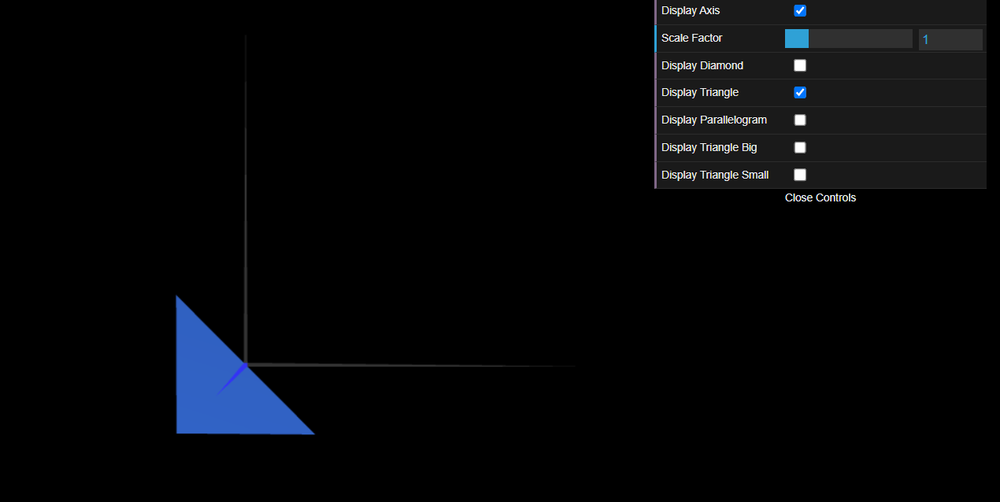
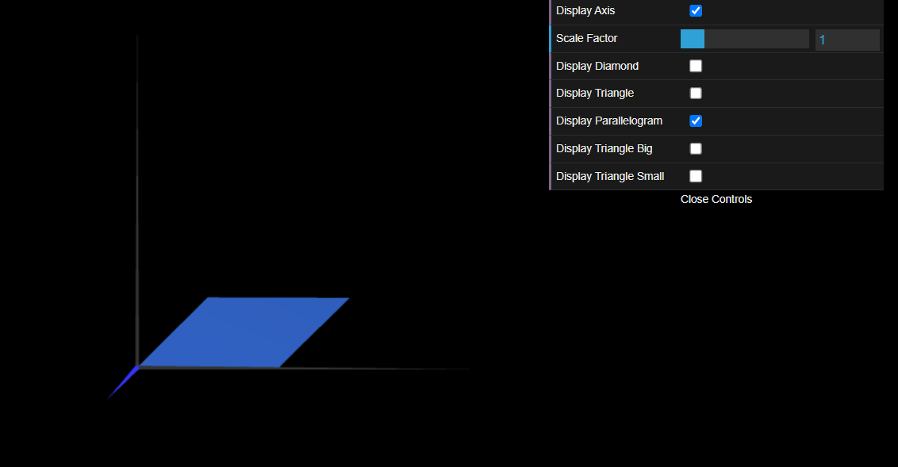
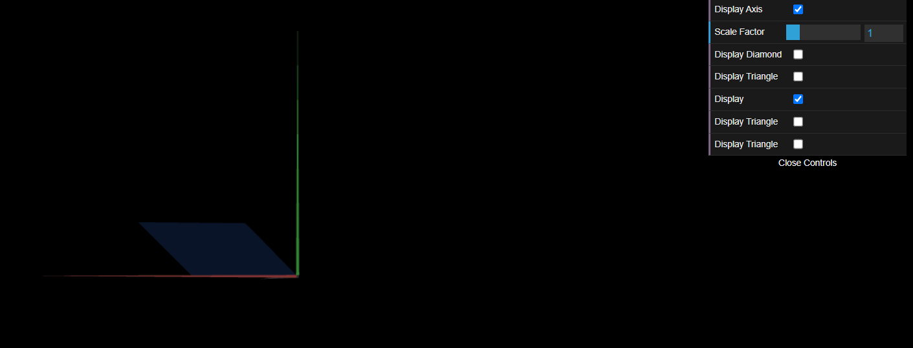
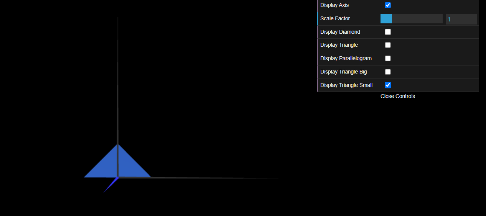
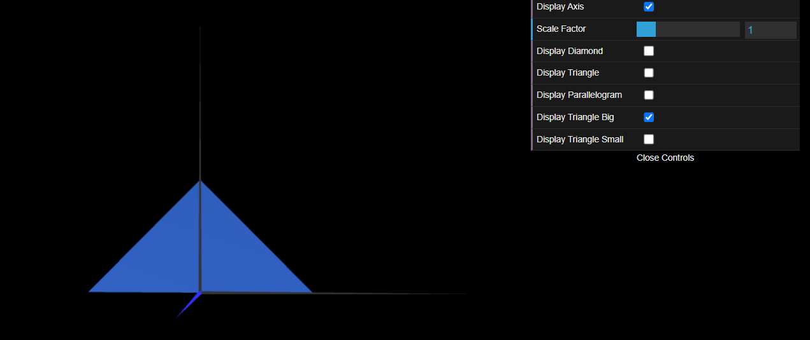

# CG 2022/2023

## Group T03G02

## TP 1 Notes

- In these exercises we learned how to create shapes and how to display them using checkboxes.
- We also learned how to make double sided objects.

