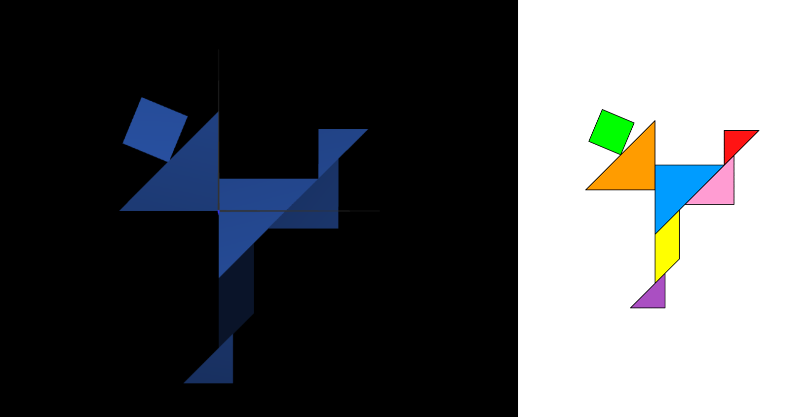
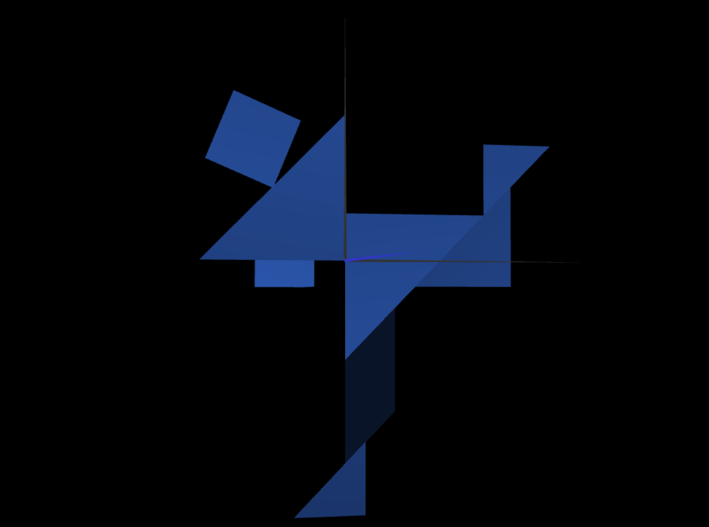
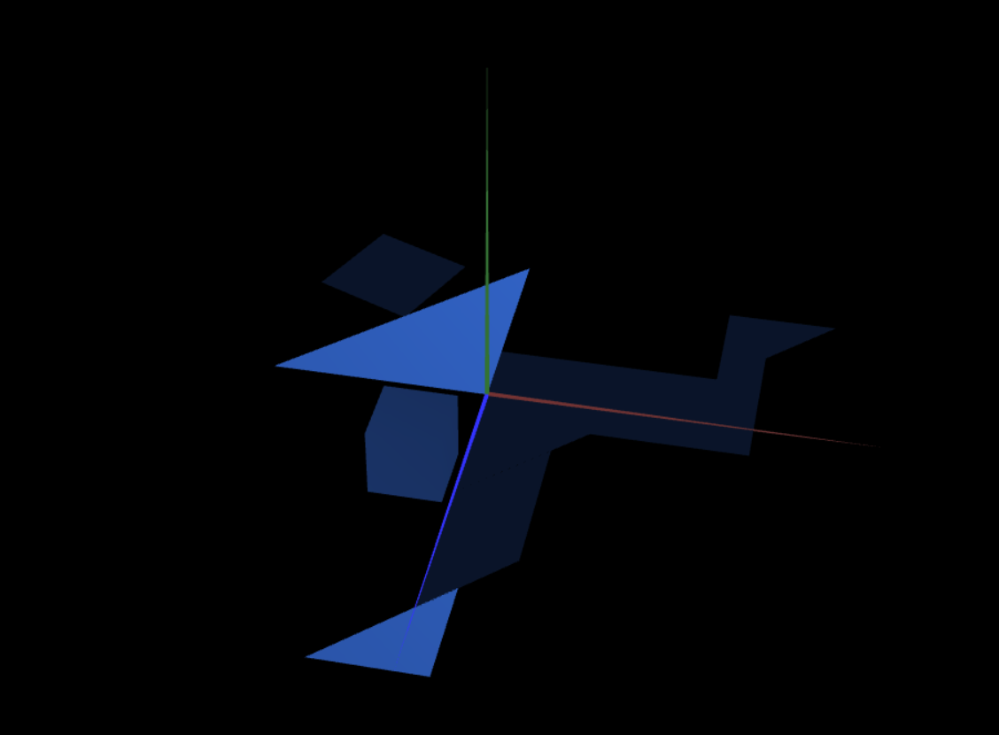
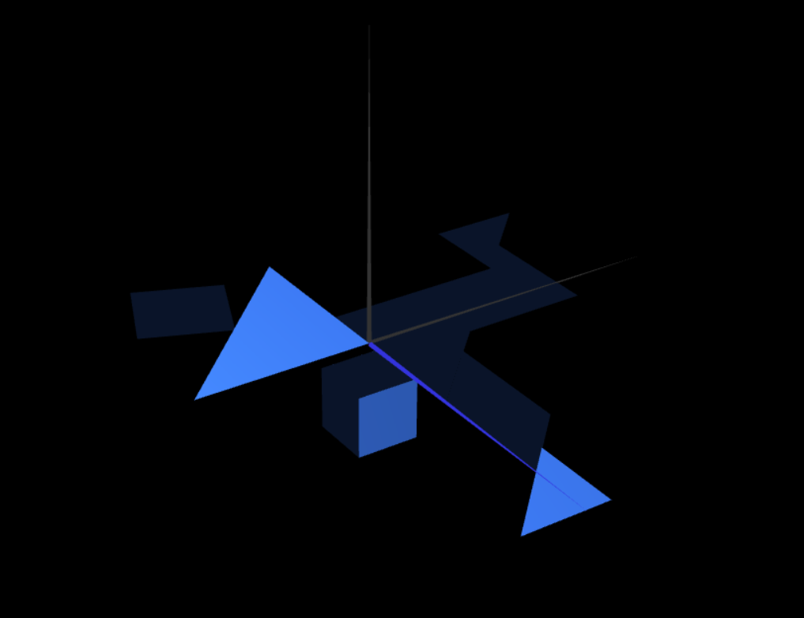

# CG 2022/2023

## Group T03G02

## TP 2 Notes

- In exercise 2, our task was to replicate the tangram that was given to us by applying geometric transformations to the shapes we created in our previous class;

- In exercise 3, we created a cube by manipulating the Z coordinate;

In exercise 4, we created a cube by using squares and using geometric transformations to make a cube;

