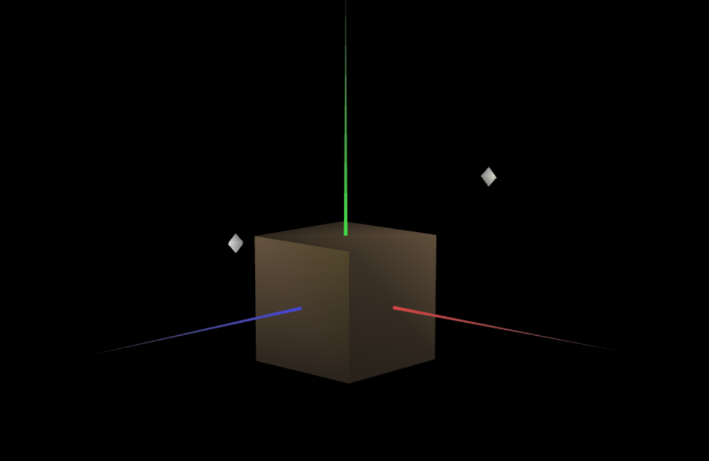
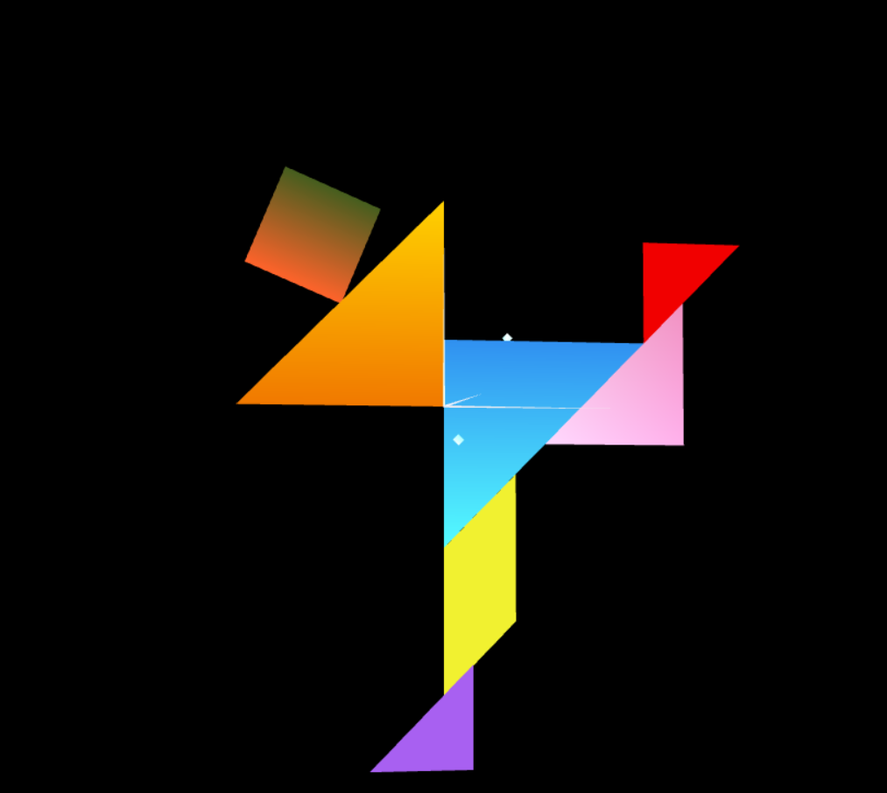
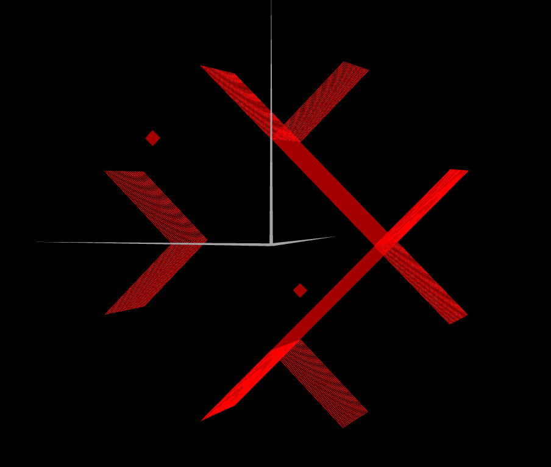
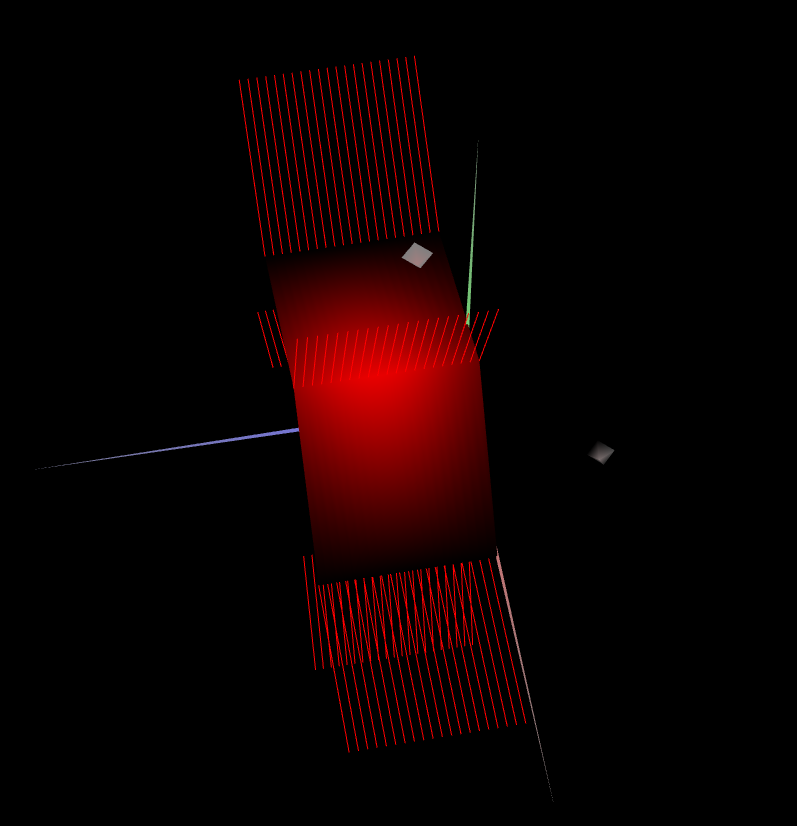

# CG 2022/2023

## Group T03G02

## TP 3 Notes

- In the first part of the given exercises, we experimented with the various lights, materials and controls, in order for us to become more comfortable with these concepts.
- We also defined the normals for the MyUnitCube and MyTangram elements created in the the last class, which led to the disappearance of the light inconsistencies we evidenced earlier.

- In exercise 4, we created a wood material and applied it on our unit cube:

- In exercises 5 and 6 we created a material for each piece of the tangram, according to the color of the original picture.

- In exercises 7, 8 and 9 we created a prism with variable sizes, made up of many stacks

- In exercise 10, 11, 12 and 13 we created a cylinder with variable sizes, made up of many stacks

