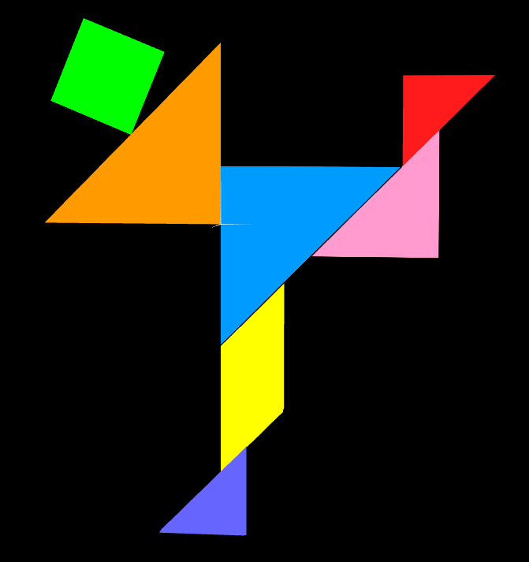
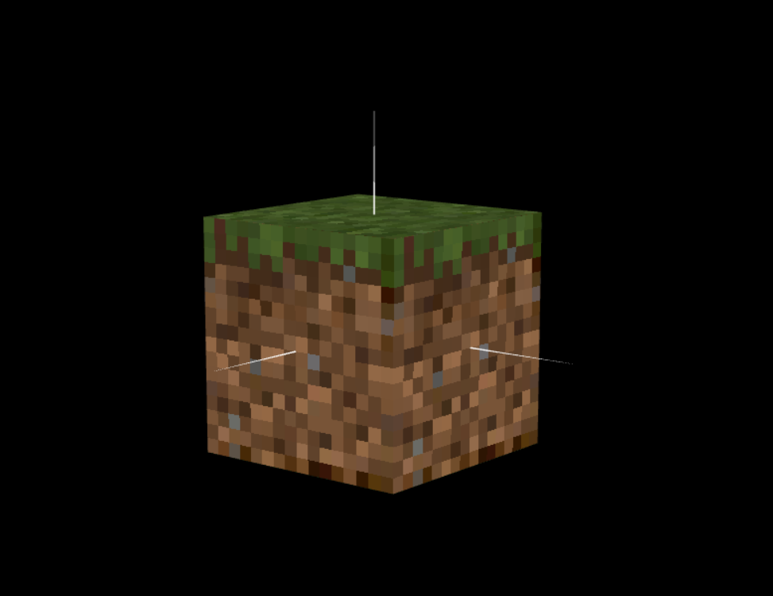

# CG 2022/2023

## Group T03G02

## TP 4 Notes

- In the first part of the given exercises, we experimented with the given textures, texture types and controls, in order for us to become more comfortable with these concepts, Texture Coordinates being one of them.
- After we understood the topics, in Exercise 4.1 we defined the Texture Coordinates for each instance of the Tangram Texture applied to the objects in the tangram, so that each texture instance fits the respective object:

- In the second part of the given exercises, we experimented created a minecraft block by applying textures to the unit cube created in the last classes.

