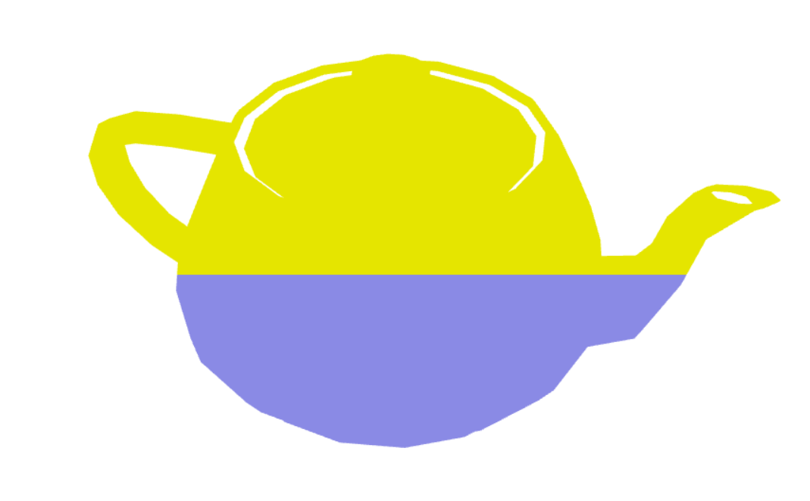
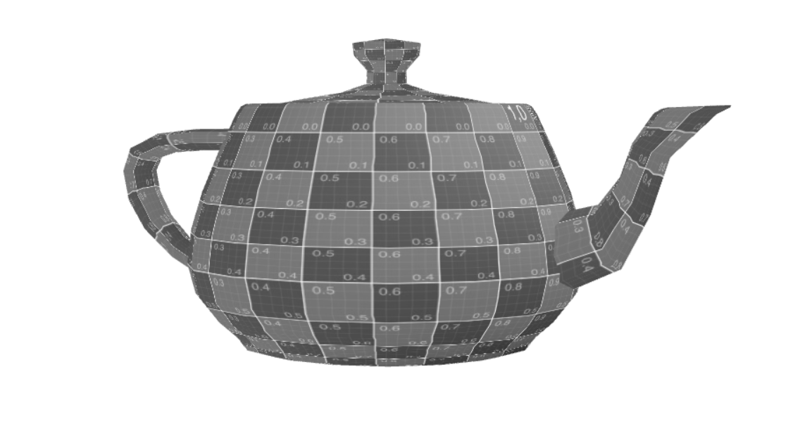
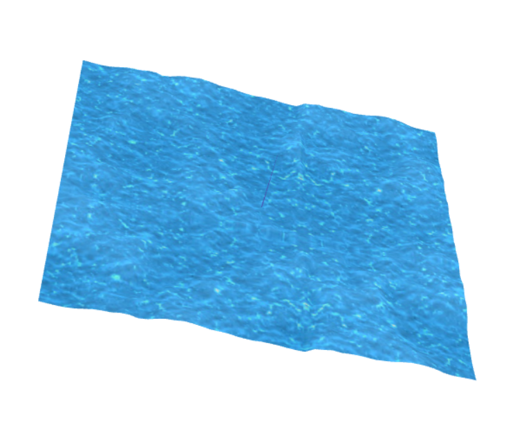

# CG 2022/2023

## Group T03G02

## TP 5 Notes

- In the first part of the given exercises, we changed the colors of the teapot:

- After that, we converted the color of the teapot to be grayscale, based on the Sepia shader:

- Finally, we created new shaders to simulate waves in a water texture:

